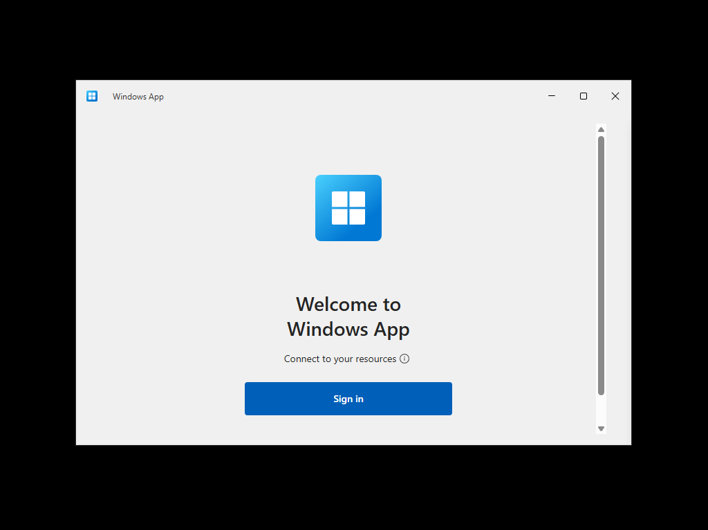
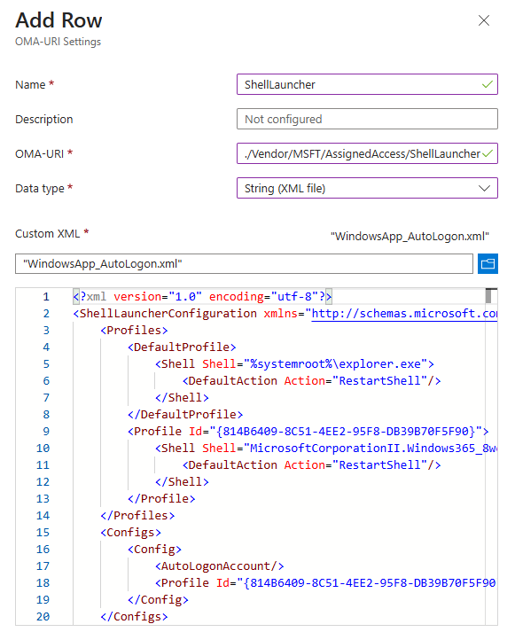
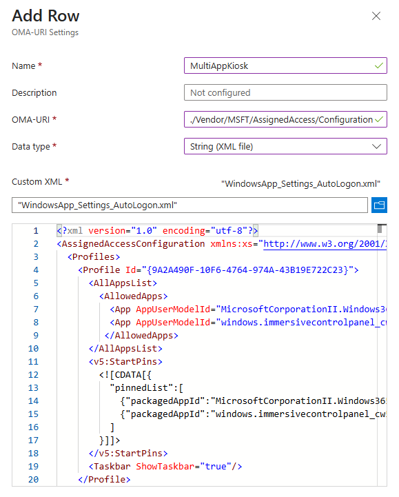
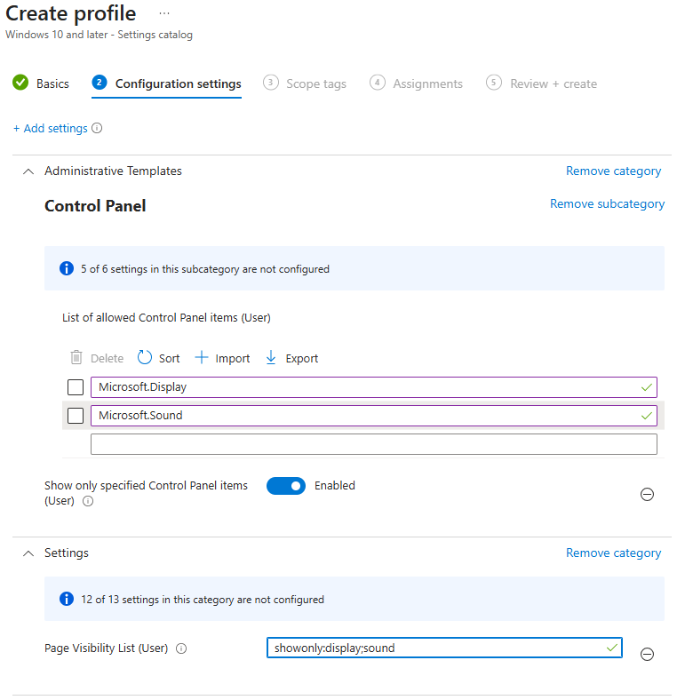
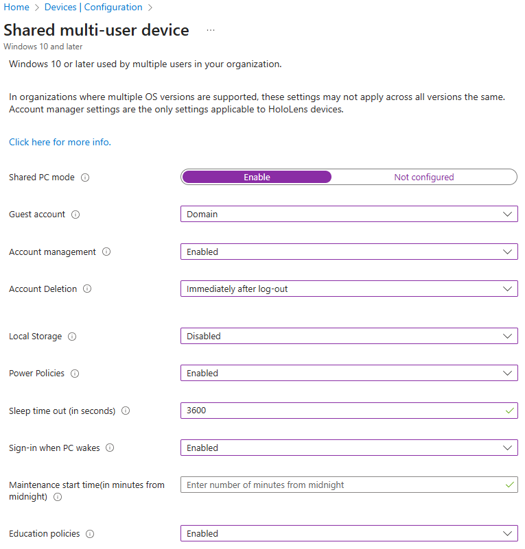

# Windows App Kiosk

## Introduction

This repository contains a script and supporting artifacts to configure a Windows client operating system to act as a custom Windows 365 or Azure Virtual Desktop client kiosk using the [Windows App](https://learn.microsoft.com/en-us/windows-app/overview).

The solution consists of two main parts: User interface customizations and Windows App configurations.

The user interface customizations are configured using:

- An Assigned Access configuration for multi-app kiosk mode or shell launcher applied via the WMI Bridge CSP.
- A multi-user local group policy object for non-administrative users.
- Applocker policy policy applied in the WindowsAppShell scenario.
- Provisioning packages that remove pinned items from the start menu, disable Windows Spotlight, and optionally enable Shared PC mode.

The Windows App configurations are designed to enforce security of the client and access to the Azure Virtual Desktop and  Windows 365 services. The options include automatic logoff behaviors, first-run experience configuration, and integration with Windows security features such as smart card removal actions.

This custom kiosk could be used for numerous scenarios including secure remote access, shared workstations, and dedicated Azure Virtual Desktop and Windows 365 endpoints.

## Prerequisites

1. A currently [supported version of Windows 11](https://learn.microsoft.com/en-us/windows/release-health/supported-versions-windows-client) with the choice of the following editions based on the `WindowsAppShell` parameter.

   1. When the `WindowsAppShell` parameter is specified, then the following editions are supported [^1]:
      - Education
      - Enterprise
      - Enterprise LTSC
      - IoT Enterprise
      - IoT Enterprise LTSC

   2. When the `WindowsAppShell` parameter is not specified, then the following editions are supported [^2]:
      - Education
      - Enterprise
      - Enterprise LTSC
      - IoT Enterprise
      - IoT Enterprise LTSC
      - Pro
      - Pro Education

2. The ability to run the installation script as SYSTEM. The instructions are provided in the [Manual Installation section](#manual-installation).

3. For most scenarios, you should [join the client device to Entra ID](https://learn.microsoft.com/en-us/entra/identity/devices/concept-directory-join) or [Entra ID Hybrid Join the device](https://learn.microsoft.com/en-us/entra/identity/devices/concept-hybrid-join).

## Sign-In Flow and User Interface

### Summary

The user interface experience is determined by several factors and parameters. The parameters are all documented in the [Parameters section](#parameters) below, but the following table outlines the resulting user interface based on the parameter values.

**Table 1:** Windows App User Interface and Sign-In Flow Summary

| AutoLogonKiosk | WindowsAppShell | User Interface |
|:--------------:|:---------------:|----------------|
| True           | True            | The Windows App replaces the explorer shell via Shell Launcher kiosk mode. Windows 11 will automatically logon with the 'KioskUser0' account. The user will be presented with the Windows App interface to connect to their Azure Virtual Desktop resources. |
| False          | True            | The Windows App replaces the explorer shell via Shell Launcher kiosk mode. The user will sign-in to the device using Entra ID credentials and will be automatically presented with the Windows App. |
| True           | False           | A Multi-App Kiosk configuration is applied via Assigned Access which locks down the explorer interface to only show the Windows App and optionally Settings. Windows 11 will automatically logon with the 'KioskUser0' account. The user will be presented with a restricted Start menu containing only the Windows App. |
| False          | False           | *This is the default configuration if no parameters are specified.* A Multi-App Kiosk configuration is applied via Assigned Access which locks down the explorer interface to only show the Windows App and optionally Settings. The user will sign-in to the device using Entra ID credentials and will be automatically presented with a restricted interface showing only approved applications. |

### Sign-In Flow Details

As documented in the Table 1, The `AutologonKiosk` parameter controls the user sign-in flow. This difference is depicted by Figure 1 below.

**Figure 1:** User Sign-In Flow Scenarios


### User Interface Details

#### Multi-App Kiosk

When the `WindowsAppShell` switch parameter is <u>not</u> specified, the device is configured using the [Multi-App Kiosk Assigned Access](https://learn.microsoft.com/en-us/windows/configuration/assigned-access/overview).

The user interface experience provides a restricted Start menu with only the Windows App and optionally the Settings app. Users can easily switch between multiple Azure Virtual Desktop or Windows 365 connections while maintaining security restrictions.

**Figure 2:** Multi-App Kiosk showing Windows App interface


The figure below illustrates the Settings applet restricted to allow the user to adjust display and audio settings. This would primarily be used in a multi-monitor scenario or when audio configuration is needed.

**Figure 3:** Multi-App Showing Display Settings


#### Windows App Shell Laucher Kiosk

When the `WindowsAppShell` parameter is selected, the Windows App replaces the default Windows 'Explorer.exe' shell using [Shell Launcher](https://learn.microsoft.com/en-us/windows/configuration/shell-launcher/).

The user interface experience provides only the Windows App with no access to other system functions, providing the highest level of security and focus.

The figure below illustrates the display of an Autologon Windows App Shell Launcher kiosk.

**Figure 4:** Windows App Shell Kiosk before Sign-in



The figure below illustrates the Windows App Shell kiosk after a user signs in to the Windows App.

**Figure 5:** Windows App Shell Kiosk showing Windows App only


## Windows App Auto Logoff Behaviors

The table below outlines the automatic logoff behaviors available for Windows App in kiosk scenarios. For more information see [Configure auto logoff on Windows](https://learn.microsoft.com/en-us/windows-app/windowsautologoff).

**Table 2:** Windows App Auto Logoff Configuration Summary

| AutoLogoffConfig | Behavior | Use Case |
| :--------------: | :------- | :------- |
| Disabled | No automatic sign-out or app data reset | Recommended if users logon to the client desktop so that the Windows operating system controls Lock and Logoff behaviors. Not recommended for the AutoLogon Kiosk scenarios |
| ResetAppOnCloseOnly | Sign out users and reset app data when the Windows App is closed | Suitable when users manually close the app |
| ResetAppAfterConnection | Sign out users and reset app data when a successful connection is made to a session host or Cloud PC. | Provides comprehensive cleanup after establishing connections. Suitable when users have only one resource assigned. |
| ResetAppOnCloseOrIdle | Sign out users and reset app data when the app is closed OR the system is idle for the specified interval | Enforces idle time restrictions to help prevent credential theft. |

## Installation

This section documents the parameters and the manual installation instructions

### Parameters

The table below describes each parameter and any requirements or usage information.

**Table 3:** Set-WindowsAppKioskSettings.ps1 Parameters

| Parameter Name   | Type   | Description | Notes/Requirements |
|:-----------------|:------:|:------------|:-------------------|
| `AutoLogonKiosk` | Switch | Determines if autologon is enabled through the Assigned Access configuration. | When configured, Windows will automatically create a new user, 'KioskUser0', which will not have a password and be configured to automatically logon when Windows starts. |
| `WindowsAppShell` | Switch | Determines whether to configure shell launcher kiosk mode with Windows App as the only available application. | When not specified, multi-app kiosk mode is used with a restricted Start menu. |
| `WindowsAppAutoLogoffConfig` | String | Determines the automatic logoff configuration for the Windows App when AutoLogonKiosk is used. | Possible values: 'Disabled', 'ResetAppOnCloseOnly', 'ResetAppAfterConnection', 'ResetAppOnCloseOrIdle'. |
| `WindowsAppAutoLogoffTimeInterval` | Int | Determines the interval in minutes at which Windows App checks for OS inactivity. | Used with 'ResetAppOnCloseOrIdle' configuration. Default is 15 minutes. |
| `InstallWindowsApp` | Switch | Determines if the latest Windows App is automatically downloaded and provisioned on the system prior to configuration. | Requires internet access to (https://go.microsoft.com/fwlink/?linkid=2262633) and the url to which it redirects. Alternatively, download the MSIX file from this link and place it in the root of the [source/WindowsApp/Apps/WindowsApp](source/WindowsApp/Apps/WindowsApp) folder |
| `SharedPC` | Switch | Determines if the computer is setup as a shared PC with automatic profile cleanup after logoff. | Only valid for direct logon mode (AutoLogonKiosk switch is not used). |
| `ShowSettings` | Switch | Determines if the Settings App appears in the restricted interface, limited to display and audio settings. | Only valid when WindowsAppShell is not specified. |
| `LockScreenAfterSeconds` | Int | Determines the number of seconds of idle time before the lock screen is displayed. | Only valid when AutoLogonKiosk is not used. |
| `SmartCardRemovalAction` | String | Determines what occurs when the smart card used for authentication is removed. | Possible values: 'Lock', 'Logoff'. Cannot be used when AutoLogonKiosk is true. |
| `ConfigureAutomaticMaintenance` | Switch | Determines if Windows automatic maintenance settings are configured via Local Group Policy. | When enabled, maintenance tasks will be active the time you specify with the `MaintenanceActivationTime` parameter with an optional random delay specified by the `MaintenanceRandomDelay` parameter. [^3] Can be used with any parameter set. |
| `MaintenanceActivationTime` | String | Specifies the time of day when automatic maintenance should begin in HH:mm:ss format. | Example: "02:00:00" for 2:00 AM. Converted to ISO 8601 format internally. Default is "00:00:00" (midnight). [^3] |
| `MaintenanceRandomDelay` | Int | Specifies the maximum random delay in hours added to the maintenance activation time. | Valid values are 1-6 hours. Prevents multiple systems from running maintenance simultaneously. Default is 2 hours. [^3] |
| `SetPowerPolicies` | Switch | Determines if the Shared PC power management policies are configured via Local Group Policy for shared PC scenarios. | Configures power buttons, sleep settings, energy saver, disables hibernation, and optimizes power behavior for shared environments. [^4] |
| `SleepAfterSeconds` | Int | Specifies the number of seconds of inactivity before the system automatically goes to sleep. | Works with SetPowerPolicies to manage power consumption. Default is 3600 seconds (1 hour). Set to 0 to Disable Sleep Timeout. [^5] |
| `Version` | Version | Writes this value to HKLM:\SOFTWARE\Kiosk\version registry key. | Allows tracking of the installed version using configuration management software. Default is '1.0.0'. |

### Manual Installation

> [!Important]
> You need to run the PowerShell script with system privileges. The easiest way to do this is to download [PSExec](https://learn.microsoft.com/en-us/sysinternals/downloads/psexec). Then extract the Zip to a folder and open an administrative command prompt.

1. Either clone the repo or download it as a zip file. If downloading the repo as a zip file, then extract it to a new folder.

2. Execute PowerShell as SYSTEM by running the following command:

    ``` cmd
    psexec64 -s -i powershell
    ```

3. In the newly opened PowerShell window, execute the following:

    ``` powershell
    Set-ExecutionPolicy Bypass -Scope Process
    ```

4. Change directories to the local 'source' directory.

5. Then execute the script using the correct parameters as exemplified below:

    - **Basic Multi-App Kiosk Configuration**

      ``` powershell
      .\Set-WindowsAppKioskSettings.ps1
      ```

    - **Multi-App Kiosk with Settings Access**

      ``` powershell
      .\Set-WindowsAppKioskSettings.ps1 -ShowSettings
      ```

    - **Windows App Shell Kiosk with AutoLogon**

      ``` powershell
      .\Set-WindowsAppKioskSettings.ps1 -WindowsAppShell -AutoLogonKiosk -WindowsAppAutoLogoffConfig 'ResetAppOnCloseOrIdle' -WindowsAppAutoLogoffTimeInterval 15
      ```

    - **Multi-App Kiosk with AutoLogon and App Reset on Close**

      ``` powershell
      .\Set-WindowsAppKioskSettings.ps1 -AutoLogonKiosk -WindowsAppAutoLogoffConfig 'ResetAppOnCloseOnly' -WindowsAppAutoLogoffTimeInterval 10
      ```

    - **Shared PC Configuration with Smart Card Support**

      ``` powershell
      .\Set-WindowsAppKioskSettings.ps1 -SharedPC -SmartCardRemovalAction 'Lock' -ShowSettings
      ```

    - **Install Windows App and Configure Kiosk**

      ``` powershell
      .\Set-WindowsAppKioskSettings.ps1 -InstallWindowsApp -WindowsAppShell -AutoLogonKiosk -WindowsAppAutoLogoffConfig 'ResetAppAfterConnection' -WindowsAppAutoLogoffTimeInterval 5
      ```

    - **Lock Screen on Idle**

      ``` powershell
      .\Set-WindowsAppKioskSettings.ps1 -LockScreenAfterSeconds 900 -ShowSettings
      ```

### Microsoft Endpoint Manager (Intune) Deployment

You can deploy this solution to multiple devices using [Microsoft Intune Win32 apps](https://learn.microsoft.com/en-us/mem/intune/apps/apps-win32-app-management) or through a mixture of configuration profiles.

#### Win32 App Deployment

**Recommended Intune Command Lines:**

**For Standard Deployments:**

``` cmd
powershell.exe -ExecutionPolicy Bypass -File Set-WindowsAppKioskSettings.ps1 -ShowSettings
```

*Use this for most corporate environments where users sign in with their own credentials*

**For Dedicated Kiosk Devices:**

``` cmd
powershell.exe -ExecutionPolicy Bypass -File Set-WindowsAppKioskSettings.ps1 -AutoLogonKiosk -WindowsAppAutoLogoffConfig "ResetAppOnCloseOrIdle" -WindowsAppAutoLogoffTimeInterval 15
```

*Perfect for lobby kiosks, conference rooms, or shared access points*

**For New Device Deployments:**

``` cmd
powershell.exe -ExecutionPolicy Bypass -File Set-WindowsAppKioskSettings.ps1 -InstallWindowsApp -SharedPC -ShowSettings
```

*Automatically installs Windows App and configures shared PC features*

You can utilize a custom detection script in Intune or use a Registry detection method to read the value of `HKEY_LOCAL_MACHINE\Software\Kiosk\version` which should be equal to the value of the version parameter used in the deployment script.

#### Mixture of Configuration Profiles

##### Shell Launcher

1. Create a custom configuration profile and specify the **OMA-URI** as './Vendor/MSFT/AssignedAccess/ShellLauncher' with the **Data type** as 'string (XML file)'. Then select the appropriate ShellLauncher XML file from the 'source\AssignedAccess\ShellLauncher' directory. Deploy to devices. [^6]

**Figure 6:** Intune Shell Launcher configuration



2. Disable Task Manager in the lock screen by creating a new Settings Catalog profile and setting **Administrative Templates | System > Ctrl+Alt+Del Options | Remove Task Manager (User)** to 'Enabled'. Deploy to Users and use a kiosk devices device filter.

##### MultiApp Kiosk

1. Create a custom configuration profile and specify the **OMA-URI** as './Vendor/MSFT/AssignedAccess/Configuration' with the **Data type** as 'string (XML file)'. Then select the appropriate MultiApp XML file from the 'source\AssignedAccess\MultiApp' directory. Deploy to devices. [^7]

  **Figure 7:** Intune Multi-App Kiosk configuration

  

2. Hide the Recommended Section of the Start Menu by, creating a custom configuration profile and specifying the **OMA-URI** as './Vendor/MSFT/Policy/Config/Start/HideRecommendedSection' with the **Data type** as 'integer'. Set the value to 1. Deploy to Devices.
3. Disable Search by creating a new Settings Catalog profile and setting **Search | Disable Search** to 'Enable'. Deploy to Devices.
4. If you deployed a Multi-App Configuration with Settings and you wish to restrict the Settings and Control Panel to only certain pages, create a new Settings Catalog profile and select the settings as shown in the figure below.

  **Figure 8:** Intune Restrict Settings and Control Panel

  

##### Common Settings

1. If desired, create a Shared multi-user device configuration profile and select the appropriate settings based on your desired configuration. The figure below shows all items configured.

  **Figure 9:** Intune Shared Multi-User Device Configuration

  

2. Disable Windows Spotlight by creating a new Settings Catalog profile and setting **Experience | Allow Windows Spotlight (User)** to 'Block'. Deploy to Users and limit it to Kiosk Devices using a device filter.
3. If you did not deploy the Shared Multi-User device configuration profile, then to disable the First Logon animation, create a Settings Catalog profile and set **Windows Logon | Enable First Logon Animation** to 'Disabled'. Deploy to Devices.
4. If you selected an autologon multiapp or shell launcher profile, then you should disable Change Password, Lock, and Logoff from the Lock Screen. Complete this by creating a new settings catalog profile and setting the following three items from **Administrative Templates | System > Ctrl+Alt+Del Options** to 'Enabled': **Remove Change Password (User)**, **Remove Lock Computer (User)**, **Remove Logoff (User)**. Deploy to users and use the Kiosk Devices device filter.
5. For autologon kiosks, you might want to configure the Windows App Autologoff behavior. You can configure this as part of your Windows App Deployment or as a remediation script.

### Manual Removal

Remove the configuration from the PowerShell prompt using:

``` powershell
.\Remove-KioskSettings.ps1
```

## Troubleshooting

### Emergency Access

**Break out of kiosk mode:** During device restart, hold **LEFT SHIFT** and repeatedly press **ENTER** until the normal login screen appears.

### Logging and Diagnostics

All configuration events are logged to: **Event Viewer > Applications and Services Logs > Windows-App-Kiosk**

### Common Issues

| Problem | Symptoms | Solution |
|---------|----------|----------|
| **Windows App missing** | Start menu shows no apps | Run: `Get-AssignedAccessConfiguration` to check kiosk settings |
| **Settings unavailable** | No Settings app visible | Verify `-ShowSettings` was used and Windows edition supports it |
| **AutoLogon fails** | Manual login required | Check if 'KioskUser0' account exists in User Management |
| **Smart card not working** | No lock/logoff on card removal | Ensure device has smart card reader and policies are applied |
| **App installation fails** | Script errors during setup | Check internet connectivity and Windows App download URL |

### Configuration Verification

**Quick Health Check:**

``` powershell
# Check kiosk configuration
Get-AssignedAccessConfiguration

# Verify installation
Get-ItemProperty "HKLM:\Software\Kiosk" -Name "version"

# Check Windows App settings
Get-ItemProperty "HKLM:\SOFTWARE\Microsoft\WindowsApp" -ErrorAction SilentlyContinue
```

## Additional Resources

- [Windows App Documentation](https://learn.microsoft.com/en-us/windows-app/)
- [Assigned Access Configuration](https://learn.microsoft.com/en-us/windows/configuration/assigned-access/)
- [Shell Launcher](https://learn.microsoft.com/en-us/windows/configuration/assigned-access/shell-launcher/)
- [Shared PC Configuration](https://learn.microsoft.com/en-us/windows/configuration/shared-pc/)
- [Azure Virtual Desktop](https://learn.microsoft.com/en-us/azure/virtual-desktop/)
- [Windows 365](https://learn.microsoft.com/en-us/windows-365/)

[^1]: For more information see [Shell Launcher Windows Edition Requirements](https://learn.microsoft.com/en-us/windows/configuration/shell-launcher/#windows-edition-requirements)
[^2]: For more information see [Assigned Access Windows Edition Requirements](https://learn.microsoft.com/en-us/windows/configuration/assigned-access/overview?tabs=ps#windows-edition-requirements)
[^3]: For more information see [Maintenance Start Time section of the Shared PC technical reference](https://learn.microsoft.com/en-us/windows/configuration/shared-pc/shared-pc-technical#maintenancestarttime)
[^4]: For more information see [Set Power Policies section of the Shared PC technical reference](https://learn.microsoft.com/en-us/windows/configuration/shared-pc/shared-pc-technical#setpowerpolicies)
[^5]: For more information see [Policy Customization section of the SharedPC (Windows Configuration Designer reference)](https://learn.microsoft.com/en-us/windows/configuration/wcd/wcd-sharedpc#policycustomization)
[^6]: For more information see [Configure a Kiosk section of the Shell Launcher reference](https://learn.microsoft.com/en-us/windows/configuration/shell-launcher/quickstart-kiosk?tabs=csp)
[^7]: For more information see [Configure a restricted user experience (multi-app kiosk) with Assigned Access](https://learn.microsoft.com/en-us/windows/configuration/assigned-access/configure-multi-app-kiosk?tabs=intune)
