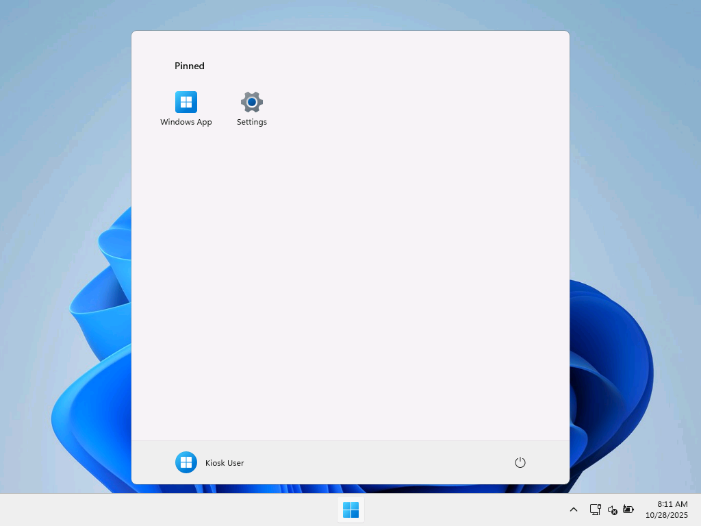
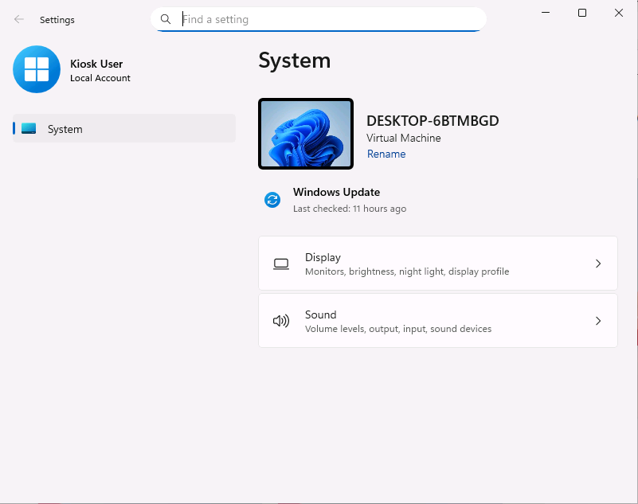
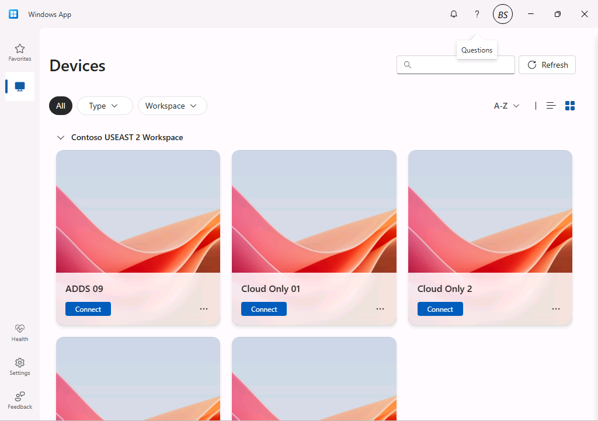

# Windows App Kiosk

## Introduction

This repository contains a script and supporting artifacts to configure a Windows client operating system to act as a custom Windows App kiosk using the [Windows App](https://learn.microsoft.com/en-us/windows-app/overview).

The solution consists of two main parts: User interface customizations and Windows App configurations.

The user interface customizations are configured using:

- An Assigned Access configuration for single-app or multi-app kiosk modes applied via the WMI Bridge CSP.
- A multi-user local group policy object for non-administrative users.
- Provisioning packages that remove pinned items from the start menu, disable Windows Spotlight, and optionally enable Shared PC mode.

The Windows App configurations are designed to enforce security of the client and access to the Azure Virtual Desktop service. The options include automatic logoff behaviors, first-run experience configuration, and integration with Windows security features such as smart card removal actions.

This custom kiosk could be used for numerous scenarios including secure remote access, shared workstations, and dedicated Azure Virtual Desktop endpoints.

## Prerequisites

1. A currently [supported version of Windows 11](https://learn.microsoft.com/en-us/windows/release-health/supported-versions-windows-client) with the choice of the following editions [^1]:
   - Education
   - Enterprise
   - Enterprise LTSC
   - IoT Enterprise
   - IoT Enterprise LTSC
   - Pro
   - Pro Education

2. The ability to run the installation script as SYSTEM. The instructions are provided in the [Manual Installation section](#manual-installation).

3. For most scenarios, you'll need to [join the client device to Entra ID](https://learn.microsoft.com/en-us/entra/identity/devices/concept-directory-join) or [Entra ID Hybrid Join the device](https://learn.microsoft.com/en-us/entra/identity/devices/concept-hybrid-join).

[^1]: For more information see [Assigned Access Windows Edition Requirements](https://learn.microsoft.com/en-us/windows/configuration/assigned-access/overview?tabs=ps#windows-edition-requirements)

## User Interface

### Summary

The user interface experience is determined by several factors and parameters. The parameters are all documented in the [Parameters section](#parameters) below, but the following table outlines the resulting user interface based on the parameter values.

**Table 1:** Windows App User Interface Summary

| SingleAppKiosk | AutoLogonKiosk | User Interface |
|:--------------:|:--------------:|----------------|
| True           | True           | The Windows App becomes the only available application via Assigned Access single-app kiosk mode. Windows 11 will automatically logon with the 'KioskUser0' account. The user will be presented with the Windows App interface to connect to their Azure Virtual Desktop resources. |
| True           | False          | The Windows App becomes the only available application via Assigned Access single-app kiosk mode. The user will sign-in to the device using Entra ID credentials and will be automatically presented with the Windows App. |
| False          | True           | A Multi-App Kiosk configuration is applied via Assigned Access which locks down the explorer interface to only show the Windows App and optionally Settings. Windows 11 will automatically logon with the 'KioskUser0' account. The user will be presented with a restricted Start menu containing only the Windows App. |
| False          | False          | *This is the default configuration if no parameters are specified.* A Multi-App Kiosk configuration is applied via Assigned Access which locks down the explorer interface to only show the Windows App and optionally Settings. The user will sign-in to the device using Entra ID credentials and will be automatically presented with a restricted interface showing only approved applications. |

### Examples

#### Multi-App Kiosk

When the `SingleAppKiosk` switch parameter is <u>not</u> specified, the device is configured using the [Multi-App Kiosk Assigned Access](https://learn.microsoft.com/en-us/windows/configuration/assigned-access/overview).

The user interface experience provides a restricted Start menu with only the Windows App and optionally the Settings app. Users can easily switch between multiple Azure Virtual Desktop connections while maintaining security restrictions.

**Figure 1:** Multi-App Kiosk showing Windows App interface



The figure below illustrates the Settings applet restricted to allow the user to adjust display and audio settings. This would primarily be used in a multi-monitor scenario or when audio configuration is needed.

**Figure 2:** Multi-App Showing Display Settings



#### Single-App Kiosk

When the `SingleAppKiosk` parameter is selected, the Windows App becomes the only available application using [Single-App Assigned Access](https://learn.microsoft.com/en-us/windows/configuration/assigned-access/overview).

The user interface experience provides only the Windows App with no access to other system functions, providing the highest level of security and focus.

**Figure 3:** Single-App Kiosk showing Windows App only



## Windows App Auto Logoff Behaviors

The table below outlines the automatic logoff behaviors available for Windows App in kiosk scenarios. For more information see [Configure auto logoff on Windows](https://learn.microsoft.com/en-us/windows-app/windowsautologoff).

**Table 2:** Windows App Auto Logoff Configuration Summary

| AutoLogoffConfig | Behavior | Use Case |
| :--------------: | :------- | :------- |
| Disabled | No automatic sign-out or app data reset | Recommended if users logon to the client desktop so that the Windows operating system controls Lock and Logoff behaviors. Not recommended for the AutoLogon Kiosk scenarios |
| ResetAppOnCloseOnly | Sign out users and reset app data when the Windows App is closed | Suitable when users manually close the app |
| ResetAppAfterConnection | Sign out users and reset app data when a successful connection is made to a session host or Cloud PC. | Provides comprehensive cleanup after establishing connections. Suitable when users have only one resource assigned. |
| ResetAppOnCloseOrIdle | Sign out users and reset app data when the app is closed OR the system is idle for the specified interval | Enforces idle time restrictions to help prevent credential theft. |

## Installation

This section documents the parameters and the manual installation instructions

### Parameters

The table below describes each parameter and any requirements or usage information.

**Table 3:** Set-WindowsAppKioskSettings.ps1 Parameters

| Parameter Name   | Type   | Description | Notes/Requirements |
|:-----------------|:------:|:------------|:-------------------|
| `AutoLogonKiosk` | Switch | Determines if autologon is enabled through the Assigned Access configuration. | When configured, Windows will automatically create a new user, 'KioskUser0', which will not have a password and be configured to automatically logon when Windows starts. |
| `SingleAppKiosk` | Switch | Determines whether to configure single-app kiosk mode with Windows App as the only available application. | When not specified, multi-app kiosk mode is used with a restricted Start menu. |
| `WindowsAppAutoLogoffConfig` | String | Determines the automatic logoff configuration for the Windows App when AutoLogonKiosk is used. | Possible values: 'Disabled', 'ResetAppOnCloseOnly', 'ResetAppAfterConnection', 'ResetAppOnCloseOrIdle'. |
| `WindowsAppAutoLogoffTimeInterval` | Int | Determines the interval in minutes at which Windows App checks for OS inactivity. | Used with 'ResetAppOnCloseOrIdle' configuration. Default is 15 minutes. |
| `InstallWindowsApp` | Switch | Determines if the latest Windows App is automatically downloaded and provisioned on the system prior to configuration. | Requires internet access to (https://go.microsoft.com/fwlink/?linkid=2262633) and the url to which it redirects. Alternatively, download the MSIX file from this link and place it in the root of the [source/WindowsApp/Apps/WindowsApp](source/WindowsApp/Apps/WindowsApp) folder |
| `SharedPC` | Switch | Determines if the computer is setup as a shared PC with automatic profile cleanup. | Only valid for direct logon mode (AutoLogonKiosk switch is not used). |
| `ShowSettings` | Switch | Determines if the Settings App appears in the restricted interface, limited to display and audio settings. | Only valid when SingleAppKiosk is not specified. |
| `LockScreenAfterSeconds` | Int | Determines the number of seconds of idle time before the lock screen is displayed. | Only valid when AutoLogonKiosk is not used. |
| `SmartCardRemovalAction` | String | Determines what occurs when the smart card used for authentication is removed. | Possible values: 'Lock', 'Logoff'. Cannot be used when AutoLogonKiosk is true. |
| `Version` | Version | Writes this value to HKLM:\SOFTWARE\Kiosk\version registry key. | Allows tracking of the installed version using configuration management software. Default is '1.0.0'. |

### Manual Installation

> [!Important]
> You need to run the PowerShell script with system privileges. The easiest way to do this is to download [PSExec](https://learn.microsoft.com/en-us/sysinternals/downloads/psexec). Then extract the Zip to a folder and open an administrative command prompt.

1. Either clone the repo or download it as a zip file. If downloading the repo as a zip file, then extract it to a new folder.

2. Execute PowerShell as SYSTEM by running the following command:

    ``` cmd
    psexec64 -s -i powershell
    ```

3. In the newly opened PowerShell window, execute the following:

    ``` powershell
    Set-ExecutionPolicy Bypass -Scope Process
    ```

4. Change directories to the local 'source\WindowsApp' directory.

5. Then execute the script using the correct parameters as exemplified below:

    - **Basic Multi-App Kiosk Configuration**

      ``` powershell
      .\Set-WindowsAppKioskSettings.ps1
      ```

    - **Multi-App Kiosk with Settings Access**

      ``` powershell
      .\Set-WindowsAppKioskSettings.ps1 -ShowSettings
      ```

    - **Single-App Kiosk with AutoLogon**

      ``` powershell
      .\Set-WindowsAppKioskSettings.ps1 -SingleAppKiosk -AutoLogonKiosk -WindowsAppAutoLogoffConfig 'ResetAppOnCloseOrIdle' -WindowsAppAutoLogoffTimeInterval 15
      ```

    - **Multi-App Kiosk with AutoLogon and App Reset on Close**

      ``` powershell
      .\Set-WindowsAppKioskSettings.ps1 -AutoLogonKiosk -WindowsAppAutoLogoffConfig 'ResetAppOnCloseOnly' -WindowsAppAutoLogoffTimeInterval 10
      ```

    - **Shared PC Configuration with Smart Card Support**

      ``` powershell
      .\Set-WindowsAppKioskSettings.ps1 -SharedPC -SmartCardRemovalAction 'Lock' -ShowSettings
      ```

    - **Install Windows App and Configure Kiosk**

      ``` powershell
      .\Set-WindowsAppKioskSettings.ps1 -InstallWindowsApp -SingleAppKiosk -AutoLogonKiosk -WindowsAppAutoLogoffConfig 'ResetAppAfterConnection' -WindowsAppAutoLogoffTimeInterval 5
      ```

    - **Lock Screen on Idle**

      ``` powershell
      .\Set-WindowsAppKioskSettings.ps1 -LockScreenAfterSeconds 900 -ShowSettings
      ```

### Microsoft Endpoint Manager (Intune) Deployment

This configuration supports deployment through Intune as a Win32 App. The instructions for creating a Win32 application are available at https://learn.microsoft.com/en-us/mem/intune/apps/apps-win32-app-management.

Example command lines:

- **Basic Configuration:**
  ``` cmd
  powershell.exe -ExecutionPolicy Bypass -File Set-WindowsAppKioskSettings.ps1 -ShowSettings
  ```

- **AutoLogon Kiosk:**
  ``` cmd
  powershell.exe -ExecutionPolicy Bypass -File Set-WindowsAppKioskSettings.ps1 -AutoLogonKiosk -WindowsAppAutoLogoffConfig "ResetAppOnCloseOrIdle" -WindowsAppAutoLogoffTimeInterval 15
  ```

- **Shared PC with Installation:**
  ``` cmd
  powershell.exe -ExecutionPolicy Bypass -File Set-WindowsAppKioskSettings.ps1 -InstallWindowsApp -SharedPC -ShowSettings
  ```

You can utilize a custom detection script in Intune or use a Registry detection method to read the value of `HKEY_LOCAL_MACHINE\Software\Kiosk\version` which should be equal to the value of the version parameter used in the deployment script.

### Manual Removal

Remove the configuration from the PowerShell prompt using:

``` powershell
.\Remove-KioskSettings.ps1
```

## Troubleshooting

1. All events from the configuration scripts are logged to the **Application and Services Logs | Windows App Kiosk** event log.

2. You can break autologon of the Kiosk User account during restart by holding down the [LEFT SHIFT] button and continuously tapping [ENTER] during restart all the way until the lock screen appears.

3. Common issues and solutions:

   - **Windows App not appearing:** Ensure the Windows App is installed and the Assigned Access configuration is properly applied.
   - **Settings not accessible:** Verify the `ShowSettings` parameter was used and the device meets the Windows edition requirements.
   - **AutoLogon not working:** Check that the 'KioskUser0' account was created and Assigned Access configuration includes AutoLogon settings.
   - **Smart card actions not triggering:** Ensure the device supports smart card authentication and the appropriate policies are applied.

4. To verify the configuration:
   - Check `Get-AssignedAccessConfiguration` to see the applied kiosk settings
   - Verify registry entries at `HKLM:\Software\Kiosk\version`
   - Review Windows App configuration at `HKLM:\SOFTWARE\Microsoft\WindowsApp`

## Additional Resources

- [Windows App Documentation](https://learn.microsoft.com/en-us/windows-app/)
- [Assigned Access Configuration](https://learn.microsoft.com/en-us/windows/configuration/assigned-access/)
- [Azure Virtual Desktop](https://learn.microsoft.com/en-us/azure/virtual-desktop/)
- [Windows 365](https://learn.microsoft.com/en-us/windows-365/)
