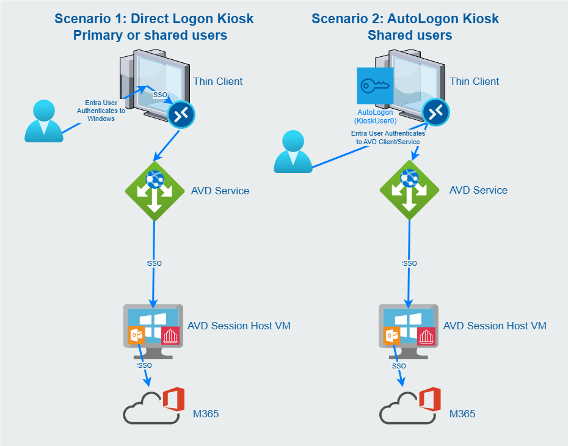
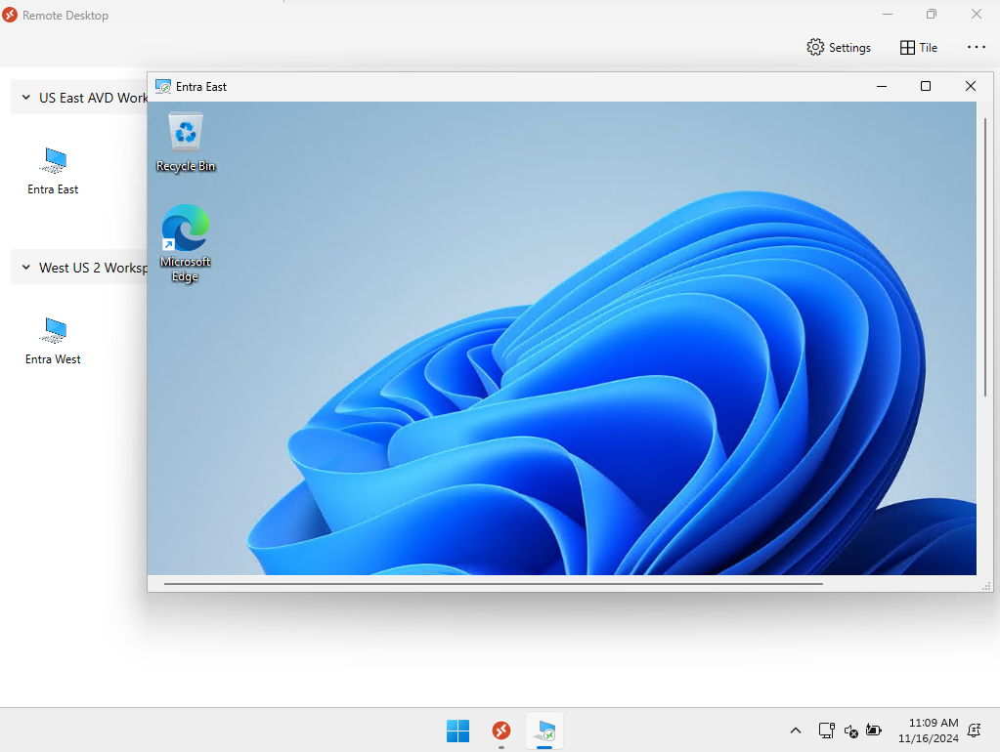
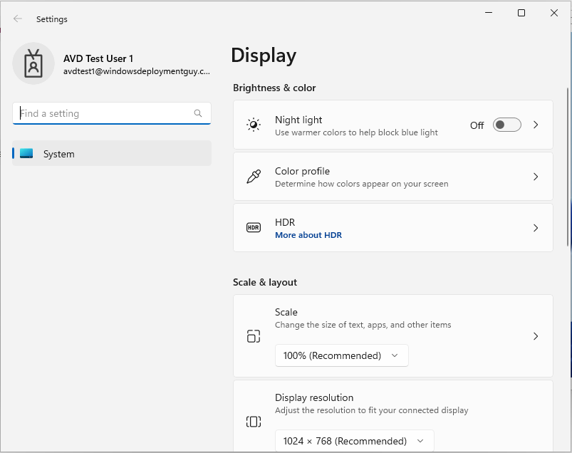
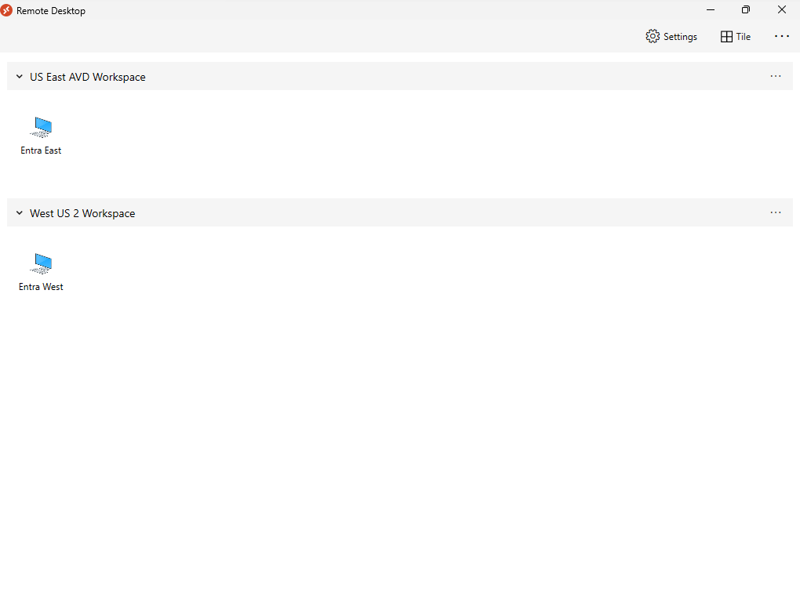

# Azure Virtual Desktop Client Kiosk

## Introduction

The source folder contains a script and supporting artifacts to configure a Windows operating system to act as a custom AVD Client kiosk. The custom user interface configuration is built with a varied combination of:

- A Shell Launcher or Multi-App configuration applied via the Assigned Access CSP WMI Bridge. The assigned access configuration varies depending on the 'AutoLogon' and 'AVDClientShell' parameters and the operating system version as follows:
- a multi-user local group policy object for non-administrative users.
- a local group policy object that affects computer settings.
- an applocker policy that disables Windows Search, Notepad, Internet Explorer, WordPad, and Edge for all Non-Administrators.
- one or more provisioning packages that remove pinned items from the start menu and enable SharedPC mode when that switch is used.

In addition to the custom user interface configuration, there are several options to enforce security of the client and access to the Azure Virtual Desktop service. The options can be summarized by the choice of triggers such as 'DeviceRemoval', 'IdleTimeout', or 'SessionDisconnect' (or supported combinations) and trigger actions such as 'Lock the workstation', 'Sign the user out of the workstation' or 'Reset the Remote Desktop client to remove cached credentials'.

There are numerous ways that this custom kiosk could be used and the following diagram illustrates some scenarios that will be discussed throughout the readme.

**Picture 1:** Azure Virtual Desktop Client Kiosk Usage Scenarios



## Prerequisites

1. A currently [supported version of a Windows client operating system](https://learn.microsoft.com/en-us/windows/release-health/supported-versions-windows-client) with the choice of editions based on the use of the **AVDClientShell** parameter as follows:
   
   1. The **AVDClientShell** option requires one of the following Windows client editions[^1]:
      * Education
      * Enterprise
      * Enterprise LTSC
      * IoT Enterprise
      * IoT Enterprise LTSC
   
   2. If you <ins>don't</ins> pick the **AVDClientShell** option, then supported Windows client editions include[^2]:
      * Education
      * Enterprise
      * Enterprise LTSC
      * IoT Enterprise
      * IoT Enterprise LTSC
      * Pro
      * Pro Education

2. The ability to run the installation script as SYSTEM. The instructions are provided in the [Installation section](#installation).

[^1]: For more information see [Shell Launcher Windows Edition Requirements](https://learn.microsoft.com/en-us/windows/configuration/assigned-access/shell-launcher/?tabs=intune#windows-edition-requirements).
[^2]: For more information see [Assigned Access Windows Edition Requirements](https://learn.microsoft.com/en-us/windows/configuration/assigned-access/overview?tabs=ps#windows-edition-requirements)

## User Interface

### Summary

The user interface experience is determined by several factors and parameters. The parameters are all documented in the [Parameters section](#parameters) below, but the following table outlines the resulting user interface based on the parameter values and operating system.

**Table 1:** Azure Virtual Desktop User Interface Summary

| AVDClientShell | AutoLogon | Operating System | User Interface |
|:--------------:|:---------:|------------------|----------------|
| True           | True      | Windows 10+ | The default explorer shell will be replaced with the Remote Desktop client for Windows via the Shell Launcher Assigned Access CSP. The Windows 10 (or later) client will automatically logon to the shell with 'KioskUser0' account. The user will be presented with a dialog to logon to Remote Desktop client. |
| True           | False     | Windows 10+ | The default explorer shell will be replaced with the Remote Desktop client for Windows via the Shell Launcher Assigned Access CSP. The user will be required to sign in to the Windows 10 (or later) client and will be automatically signed in to the Remote Desktop client. |
| False          | True      | Windows 10 | The default shell remains explorer.exe; however, it is heavily customized and locked down to allow only the Remote Desktop client to be executed from the customized Start Menu. This configuration allows for easier user interaction with remote sessions, the Remote Desktop client interface, and Display Settings if the option is chosen. The Shell Launcher configuration of the Assigned Access CSP is used to configure the Windows 10 client with autologon to the shell with the 'KioskUser0' account. The user will be presented with a dialog to logon to Remote Desktop client. |
| False          | True      | Windows 11 | A Multi-App Kiosk configuration is applied via the Assigned Access CSP which automatically locks down the explorer interface to only show the Remote Desktop client. This configuration allows for easier user interaction with remote sessions and the Remote Desktop client along with Display Settings if the option is chosen. The Windows 11 22H2+ client will automatically logon to the shell with 'KioskUser0' account. The user will be presented with a dialog to logon to Remote Desktop client. |
| False          | False     | Windows 10 | *This is the default configuration if no parameters are specified when running the script on Windows 10.* The explorer shell is the default shell; however, it is heavily customized and locked down to allow only the Remote Desktop client to be executed from the customized Start Menu. This configuration allows for easier user interaction with remote sessions, the Remote Desktop client interface, and display settings if the option is chosen. The user will be required to sign in to the Windows 10 client and will be automatically signed in to the Remote Desktop client. |
| False          | False     | Windows 11 | *This is the default configuration if no parameters are specified when running the script on Windows 11 22H2+.* A Multi-App Kiosk configuration is applied via the Assigned Access CSP which automatically locks down the explorer interface to only show the Remote Desktop client. This configuration allows for easier user interaction with remote sessions, the Remote Desktop client interface, and the display settings if the option is chosen. The user will be required to sign in to the Windows 11 client and will be automatically signed in to the Remote Desktop client. |

### Examples

#### Multi-App Kiosk

When the operating system of the thin client device is Windows 11 22H2 or greater, and the **AVDClientShell** switch parameter is **not** specified, the device is configured using the [Multi-App Kiosk Assigned Access CSP](https://learn.microsoft.com/en-us/windows/iot/iot-enterprise/customize/multi-app-kiosk). The user interface experience with the **ShowDisplaySettings** parameter selected is shown in the video and pictures below.

https://github.com/user-attachments/assets/b85689b2-8f15-4177-9f4e-ad012d5dce51

**Picture 2:** Multi-App Showing a client connection



**Picture 3:** Multi-App Showing Display Settings



#### Shell Launcher

When the **AVDClientShell** parameter is selected on any operating system, the default user shell (explorer.exe) is replaced with the [Remote Desktop client](https://learn.microsoft.com/en-us/azure/virtual-desktop/users/connect-remote-desktop-client?tabs=windows) using the [Shell Launcher CSP](https://learn.microsoft.com/en-us/windows/iot/iot-enterprise/customize/shell-launcher). The user interface experience is shown in the video and picture below. 

https://github.com/user-attachments/assets/5252b15d-a953-4b5a-9e3f-541c493df85e

**Picture 4:** Shell Launcher full screen



## Trigger Actions

The table below outlines the actions taken based on the `Autologon`, `Triggers`, `SmartCard` or `DeviceVendorId` (Device Type), and `TriggerAction` parameters.

**Table 2:** Trigger Action Summary

| AutoLogon | Trigger | DeviceType | TriggerAction | Behavior |
|:---------:|:-------:|:----------:|:-------------:|----------|
| True | IdleTimeout | | ResetClient | The client launch script starts a timer at 0. Every 60 seconds, it checks to see if there are cached credentials and no open Remote Connections to resources. If this condition is true, then it increments the counter by 60 seconds. If it is not true, then the counter is reset to 0. If the counter reaches the value specified by the `Timeout` parameter, then the launch script resets the client removing the cached credentials and restarts the launch script. |
| True | SessionDisconnect | | ResetClient | The client launch script creates a WMI Event Filter that fires when a Remote Desktop connection is closed based on an event ID 1026 in the 'Microsoft-Windows-TerminalServices-RDPClient/Operational' log. When this event is detected the event log is queried for reason codes that indicate the connection was closed due to a remote connection (from another client system) or a locked or disconnected session. When these events are detected and there are no other open remote desktop connections, the launch script resets the client removing the cached credentials and restarts the launch script. |
| True | DeviceRemoval | Either | ResetClient | The client launch script creates a WMI Event Filter that fires when a user removes their authentication device (either a SmartCard or FIDO2 token) or closes the Remote Desktop client, then the launch script resets the client removing the cached credentials and restarts the launch script. |
| | IdleTimeout | | Lock | The system will lock the computer after the amount of time specified in the `Timeout` parameter using the [Interactive Logon Machine Inactivity Limit built-in policy](https://learn.microsoft.com/en-us/previous-versions/windows/it-pro/windows-10/security/threat-protection/security-policy-settings/interactive-logon-machine-inactivity-limit) Windows. |
| | IdleTimeout | | Logoff | The client launch script starts a timer at 0. Every 60 seconds, it checks to see if there are cached credentials and no open Remote Connections to resources. If this condition is true, then it increments the counter by 60 seconds. If it is not true, then the counter is reset to 0. If the counter reaches the value specified by the `Timeout` parameter, then the launch script will logoff the user. |
| | DeviceRemoval | SmartCard | Lock | The built-in Smart Card Policy removal service is configured using the [SmartCard removal behavior policy](https://learn.microsoft.com/en-us/previous-versions/windows/it-pro/windows-10/security/threat-protection/security-policy-settings/interactive-logon-smart-card-removal-behavior) to lock the system when the smart card is removed. |
| | DeviceRemoval | FIDO2 | Lock |  The client launch script creates a WMI Event Filter that fires when a user removes their FIDO2 token device. When the event is detected, the script locks the computer. |
| | DeviceRemoval | SmartCard | Logoff | The built-in Smart Card Policy removal service is configured using the [SmartCard removal behavior policy](https://learn.microsoft.com/en-us/previous-versions/windows/it-pro/windows-10/security/threat-protection/security-policy-settings/interactive-logon-smart-card-removal-behavior) to Force Logoff the user when the smart card is removed. |
| | DeviceRemoval | FIDO2 | Logoff |  The client launch script creates a WMI Event Filter that fires when a user removes their FIDO2 token device. When the event is detected, the script forcefully logs the user off the computer. |

## Installation

This section documents the parameters and the manual installation instructions

### Parameters

The table below describes each parameter and any requirements or usage information.

**Table 2:** Set-AVDClientKioskSettings.ps1 Parameters

| Parameter Name | Type | Description | Notes/Requirements |
|:---------------|:----:|:------------|:-------------------|
| `ApplySTIGs` | Switch | Determines if the latest DoD Security Technical Implementation Guide Group Policy Objects are automatically downloaded from [Cyber Command](https://public.cyber.mil/stigs/gpo) and applied via the Local Group Policy Object (LGPO) tool to the system. | If they are, then several delta settings are applied to allow the system to communicate with Entra Id and complete autologon (if applicable). Requires access to https://public.cyber.mil/stigs/gpo |
| `Autologon` | Switch | Determines if Autologon is enabled through the Shell Launcher or Multi-App Kiosk configuration. | When configured, Windows will automatically create a new user, 'KioskUser0', which will not have a password and be configured to automatically logon when Windows starts. |
| `AVDClientShell` | Switch | Determines whether the default Windows shell (explorer.exe) is replaced by the Remote Desktop client for Windows. | When not specified the default shell is used and, on Windows 11 22H2 and later, the Multi-App Kiosk configuration is used along with additional local group policy settings and provisioning packages to lock down the shell. On Windows 10, only local group policy settings and provisioning packages are used to lock down the shell. |
| `DeviceVendorID` | String | Defines the Vendor ID of the hardware FIDO2 authentication token that, if removed, will trigger the action defined in `TriggerAction`. | You can find the Vendor ID by looking at the Hardware IDs property of the device in device manager. See the [example for a Yubikey](docs\media\HardwareIds.png). This value is only used when `Triggers` contains 'DeviceRemoval'. |
| `EnvironmentAVD` | String | Determines the Azure environment to which you are connecting. | Determines the Url of the Remote Desktop Feed which varies by environment by setting the '$SubscribeUrl' variable and replacing placeholders in several files during installation. The list of Urls can be found at https://learn.microsoft.com/en-us/azure/virtual-desktop/users/connect-microsoft-store?source=recommendations#subscribe-to-a-workspace. Default is 'AzureUSGovernment' |
| `InstallAVDClient` | Switch | Determines if the latest Remote Desktop client for Windows and the Visual Studio C++ Redistributables are downloaded from the Internet and installed prior to configuration. | Requires access to https://go.microsoft.com/fwlink/?linkid=2139369 and https://aka.ms/vs/17/release/vc_redist.x64.exe |
| `SharedPC` | Switch | Determines if the computer is setup as a shared PC. The account management process is enabled and all user profiles are automatically deleted on logoff. | Only valid for direct logon mode ("Autologon" switch is not used). |
| `ShowDisplaySettings` | Switch | Determines if the Settings App and Control Panel are restricted to only allow access to the Display Settings page. If this value is not set, then the Settings app and Control Panel are not displayed or accessible. | Only valid when the `AVDClientShell` switch is not specified. |
| `SmartCard` | Switch | Determines if SmartCard removal will trigger the action specified by `TriggerAction`. | This value is only used when `Triggers` contains 'DeviceRemoval'. |
| `Triggers` | string[] | Determines the trigger(s) that will cause the action specified by `TriggerAction` to be carried out. | When the `AutoLogon` switch is specified, you can choose any or all of the following values: 'DeviceRemoval', @('DeviceRemoval', 'IdleTimeout'), 'IdleTimeout', @('IdleTimeout', 'SessionDisconnect'), or 'SessionDisconnect'. When the `AutoLogon` is not specified, you can specify 'DeviceRemoval', @('DeviceRemoval', 'IdleTimeout'), or 'IdleTimeout'. If your choices contain 'DeviceRemoval', then you must use the `SmartCard` switch or specify a `DeviceVendorID`. |
| `TriggerAction` | String | Determines what occurs when the specified trigger is detected. | The possible values are different depending on whether the `AutoLogon` switch is set. When the `AutoLogon` switch is specified, then 'ResetClient' is aassumed. When the `AutoLogon` switch is not specified, then 'Lock' or 'Logoff' are allowed. |
| `Version` | Version |  Writes this value to a string value called 'version' at HKLM:\SOFTWARE\Kiosk registry key. | Allows tracking of the installed version using configuration management software such as Microsoft Endpoint Manager or Microsoft Endpoint Configuration Manager by querying the value of this registry value. |

The table below highlights the allowed combination of parameters. If a cell if left blank then it indicates a value cannot be provided for this parameter given the other parameter values specified.

**Table 3:** Parameter Usage Matrix

<table>
<tr valign="top">
<th align="center" rowspan="2">Scenario</th><th align="center" rowspan="2">AutoLogon</th><th align="center" rowspan="2">Triggers</th><th align="center" colspan="2">Devices</th><th rowspan="2">TriggerAction</th>
</tr>
<tr>
<th align="center">DeviceVendorID</th><th align="center">SmartCard</th>
</tr>
<tr>
<td align="center">1</td><td align="center"></td><td align="center">'DeviceRemoval'</td><td align="center">specified</td><td align="center"></td><td align="center">Lock or Logoff</td>
</tr>
<tr>
<td align="center">1</td><td align="center"></td><td align="center">'DeviceRemoval'</td><td align="center"></td><td align="center">true</td><td align="center">Lock or Logoff</td>
</tr>
<tr>
<td align="center">1</td><td align="center"></td><td align="center">'DeviceRemoval', 'IdleTimeout'</td><td align="center">specified</td><td align="center"></td><td align="center">Lock or Logoff</td>
</tr>
<tr>
<td align="center">1</td><td align="center"></td><td align="center">'DeviceRemoval', 'IdleTimeoute'<td align="center"></td><td align="center">true</td><td align="center">Lock or Logoff</td>
</tr>
<tr>
<td align="center">1</td><td align="center"></td><td align="center">'IdleTimeout'</td><td align="center"></td><td align="center"></td><td align="center">Lock or Logoff</td>
</tr>
<tr>
<td align="center">2</td><td align="center">true</td><td align="center">'DeviceRemoval'</td><td align="center">specified</td><td align="center"></td><td align="center">ResetClient</td>
</tr>
<tr>
<td align="center">2</td><td align="center">true</td><td align="center">'DeviceRemoval'</td><td align="center"></td><td align="center">true</td><td align="center">ResetClient</td>
</tr>
<tr>
<td align="center">2</td><td align="center">true</td><td align="center">'DeviceRemoval', 'IdleTimeout'</td><td align="center">specified</td><td align="center"></td><td align="center">ResetClient</td>
</tr>
<tr>
<td align="center">2</td><td align="center">true</td><td align="center">'DeviceRemoval', 'IdleTimeout'</td><td align="center"></td><td align="center">true</td><td align="center">ResetClient</td>
</tr>
<tr>
<td align="center">2</td><td align="center">true</td><td align="center">'IdleTimeout'</td><td align="center"></td><td align="center"></td><td align="center">ResetClient</td>
</tr>
<tr>
<td align="center">2</td><td align="center">true</td><td align="center">'IdleTimeout', 'SessionDisconnect'</td><td align="center"></td><td align="center"></td><td align="center">ResetClient</td>
</tr>
<tr>
<td align="center">2</td><td align="center">true</td><td align="center">'SessionDisconnect'</td><td align="center"></td><td align="center"></td><td align="center">ResetClient</td>
</tr>
<tr>
<td align="center">3</td><td align="center"></td><td align="center"></td><td align="center"></td><td align="center"></td><td align="center"></td>
</tr>
</table>

### Manual Installation

> [!Important]
> You need to run the PowerShell script with system priviledges. The easiest way to do this is to download [PSExec](https://learn.microsoft.com/en-us/sysinternals/downloads/psexec). Then extract the Zip to a folder and open an administrative command prompt.

1. Execute PowerShell as SYSTEM by running the following command:

    ```
    psexec64 -s -i powershell
    ```

2. In the newly opened PowerShell window, execute the following:

    ``` powershell
    set-executionpolicy bypass -scope process
    ```

3. Change directories to the source directory.

4. Then execute the script using the correct parameters as exemplified below:

   > [!Important]
   > These parameter combinations are not the only ones possible. See Table 3 above.

    * Scenario 1 Options

      * Lock the workstation when a SmartCard is Removed or 15 minutes of inactivity has occurred.

        ``` powershell
        .\Set-AVDClientKioskSettings.ps1 -SmartCard -Triggers 'DeviceRemoval', 'IdleTimeout' -TriggerAction 'Lock' -Timeout 900
        ```

      * Logoff the user when a Yubikey is Removed or 15 minutes of inactivity has occurred.

        ``` powershell
        .\Set-AVDClientKioskSettings.ps1 -DeviceVendorID '1050' -Triggers 'DeviceRemoval', 'IdleTimeout' -TriggerAction 'Logoff' -Timeout 900
        ```

    * Scenario 2 Options

      * Reset when SmartCard is Removed:
  
        ``` powershell
        .\Set-AVDClientKioskSettings.ps1 -AutoLogon -SmartCard -Triggers 'DeviceRemoval' -TriggerAction 'ResetClient'
        ```

      * Reset when Yubikey is Removed
    
        ``` powershell
        .\Set-AVDClientKioskSettings.ps1 -AutoLogon -DeviceVendorID '1050' -Triggers 'DeviceRemoval' -TriggerAction 'ResetClient'
        ```

      * Reset when Remote Sessions are disconnected

        ``` powershell
        .\Set-AVDClientKioskSettings.ps1 -AutoLogon -Triggers 'SessionDisconnect' -TriggerAction 'ResetClient'
        ```

      * Reset when Remote Sessions are disconnected or 15 minutes of idle time has passed.

        ``` powershell
        .\Set-AVDClientKioskSettings.ps1 -AutoLogon -Triggers 'IdleTimeout', 'SessionDisconnect' -TriggerAction 'ResetClient' -Timeout 900
        ```
  
    * Scenario 3 Options

      For this scenario, you do **not** want to specify a trigger action or AutoLogon. Instead you would need to configure the system to autologon using the [AutoLogon SysInternals utility](https://learn.microsoft.com/en-us/sysinternals/downloads/autologon) and then not use any trigger actions. In fact, the default options would work.

      ``` powershell
      .\Set-AVDClientKioskSettings.ps1
      ```

    * Other Parameters

      * Replace the Windows default shell with the Remote Desktop client.

        ``` powershell
        .\Set-AVDClientKioskSettings.ps1 -AVDClientShell [other parameters]
        ```

      * Install the Remote Desktop client

        ``` powershell
        .\Set-AVDClientKioskSettings.ps1 -InstallAVDClient [other parameters]
        ```

      * Allow Display Settings modification by kiosk users.
    
        ``` powershell
        .\Set-AVDClientKioskSettings.ps1 -ShowDisplaySettings [other parameters]
        ```

### Microsoft Endpoint Manager (Intune) Deployment

This configuration supports deployment through Intune as a Win32 App. The instructions for creating a Win32 application are available at https://learn.microsoft.com/en-us/mem/intune/apps/apps-win32-app-management.

The command line should be similar to:

``` cmd
powershell.exe -executionpolicy bypass -file Set-AVDClientKioskSettings.ps1 -SharedPC -DeviceID '1050' -EnvironmentAVD AzureCloud -ShowDisplaySettings -Triggers 'DeviceRemoval' -TriggerAction 'Lock'
```

You can utilize the DetectionScript.ps1 as a custom detection script in Intune which will automatically look for all the configurations applied by the script. you can also use a Registry detection method to read the value of ```HKEY_LOCAL_MACHINE\Software\Kiosk\version``` which should be equal to the value of the version parameter used in the deployment script. This would be useful for when you do not implement AutoLogon.

### Manual Removal

Remove the configuration from the PowerShell prompt using:

``` powershell
.\Remove-KioskSettings.ps1
```
## Troubleshooting

1. All events from the configuration scripts and scheduled tasks are logged to the **Application and Services Logs | AVD Client Kiosk** event log.
2. You can break autologon of the Kiosk User account during restart by holding down the [LEFT SHIFT] button down and continuously tap [ENTER] during restart all the way to the lock screen appears.
